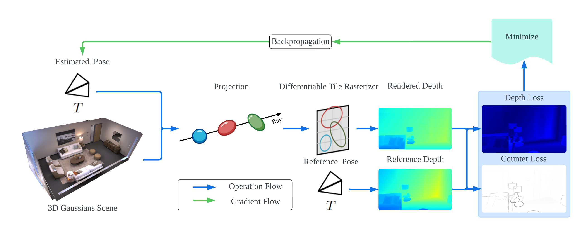

<p align="center">
  <h1 align="center">GSplatLoc: Ultra-Precise Camera Localization via 3D Gaussian Splatting</h1>
  <p align="center">
    <a href="https://notes.atticux.me/"><strong>Atticus Zeller</strong></a>
  </p>
</p>

<p align="center">
  <a href="">
    
  </a>
</p>


## 📌 Citation

If you find our paper and code useful, please cite us:

```bib
@misc{zeller2024gsplatlocultraprecisecameralocalization,
      title={GSplatLoc: Ultra-Precise Camera Localization via 3D Gaussian Splatting}, 
      author={Atticus J. Zeller},
      year={2024},
      eprint={2412.20056},
      archivePrefix={arXiv},
      primaryClass={cs.CV},
      url={https://arxiv.org/abs/2412.20056}, 
}
```
